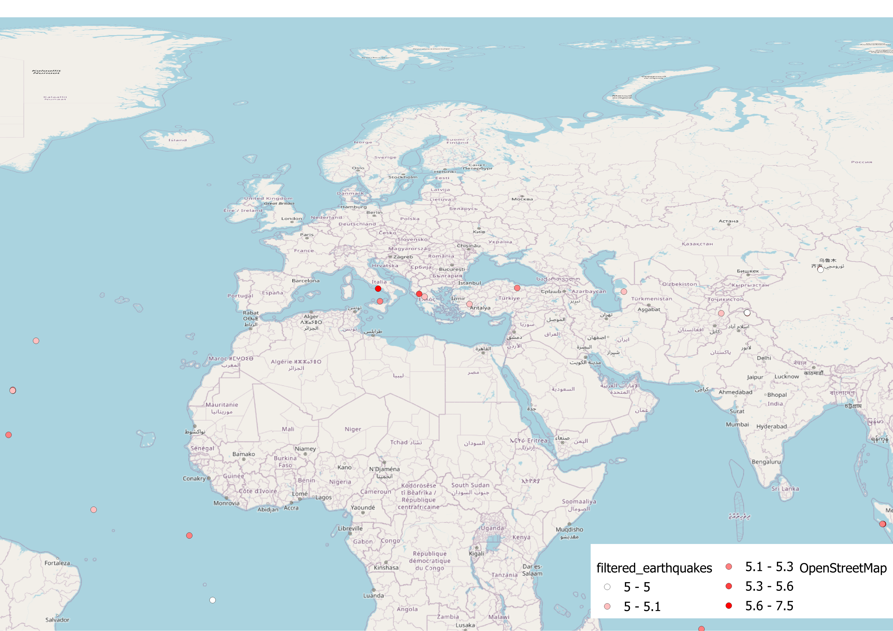

# Spatial Analysis and Automated ETL Pipeline for Global Earthquakes


## 📌 Project Overview
This project implements an automated, production-grade ETL (Extract, Transform, Load) pipeline to retrieve, process, and visualize real-time global earthquake data from the USGS (United States Geological Survey) API. 

The pipeline is designed with modular software engineering principles, ensuring clean architecture, reproducibility, and seamless integration with external Geographic Information System (GIS) tools like QGIS.

## 🏗️ Architecture & Project Structure
The repository follows standard Data Science project structures to separate configurations, source code, and outputs:

```text
earthquake-spatial-analysis/
├── data/
│   └── processed/            # Cleaned data ready for GIS integration
├── outputs/                  # Generated interactive HTML maps and static layouts
├── src/                      # Core pipeline modules
│   ├── __init__.py
│   ├── data_ingestion.py     # API connection and data retrieval
│   ├── processing.py         # Data cleaning and magnitude filtering
│   └── visualization.py      # Interactive spatial visualization
├── config.py                 # Pipeline configurations and thresholds
├── main.py                   # Main execution script
├── requirements.txt          # Environment dependencies
└── README.md                 # Project documentation
```

## ⚙️ Key Features
* **Automated Data Ingestion:** Fetches real-time seismic events directly from the USGS endpoint.
* **Modular Processing:** Filters significant earthquakes (configurable magnitude threshold, default >= 5.0) for targeted spatial analysis.
* **Interactive Web Mapping:** Automatically generates a dynamic, interactive map using `Folium`, clustering and scaling points based on earthquake magnitude.
* **GIS Ready:** Exports the processed spatial dataset into a structured CSV format optimized for advanced styling and spatial joins in desktop GIS software (e.g., QGIS, ArcGIS).

## 🚀 How to Run the Pipeline

**1. Clone the repository and set up the environment:**
```bash
git clone https://github.com/atakanbircan/earthquake-spatial-analysis.git
cd earthquake-spatial-analysis
pip install -r requirements.txt
```

**2. Execute the automated pipeline:**
```bash
python main.py
```

**3. Pipeline Outputs:**
* `data/processed/filtered_earthquakes.csv`: The cleaned spatial dataset.
* `outputs/earthquake_map.html`: The interactive Folium map.

## 🗺️ Advanced GIS Visualization (QGIS)
While the Python pipeline handles the data engineering and interactive web mapping, the static, high-resolution cartographic layouts were designed using **QGIS**. 

The processed dataset was imported into QGIS using WGS 84 (EPSG:4326), categorized using graduated symbology based on the `mag` attribute, and overlaid on an OpenStreetMap basemap.

### QGIS Print Layout Output:
*(Note: The map below is generated via the QGIS Print Layout using the automated outputs of this pipeline.)*



---
*Developed as a portfolio project demonstrating spatial data engineering and GIS integration.*